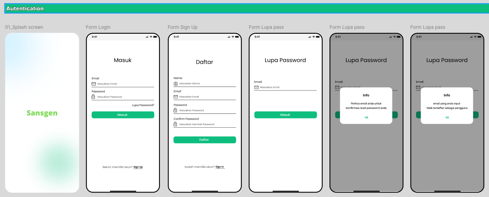
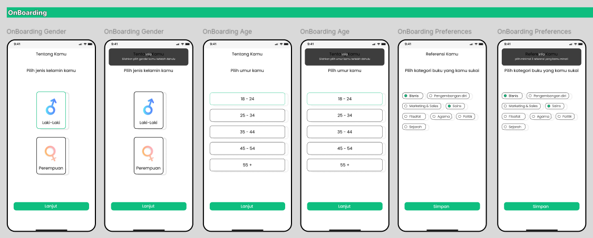
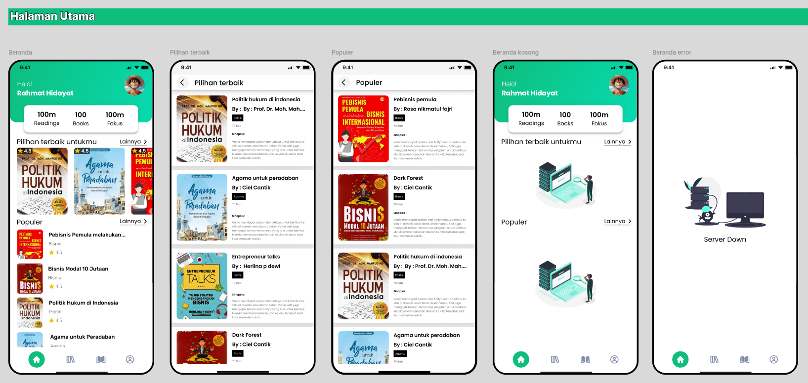
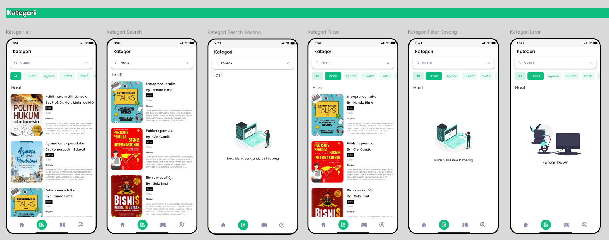
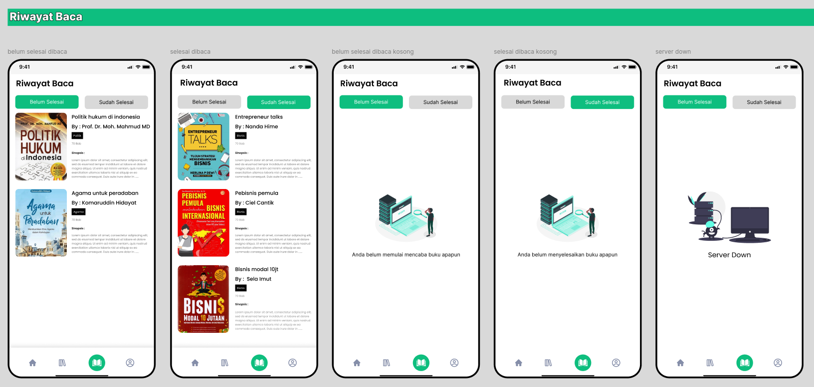
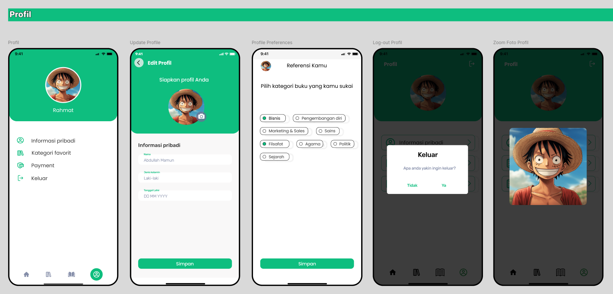
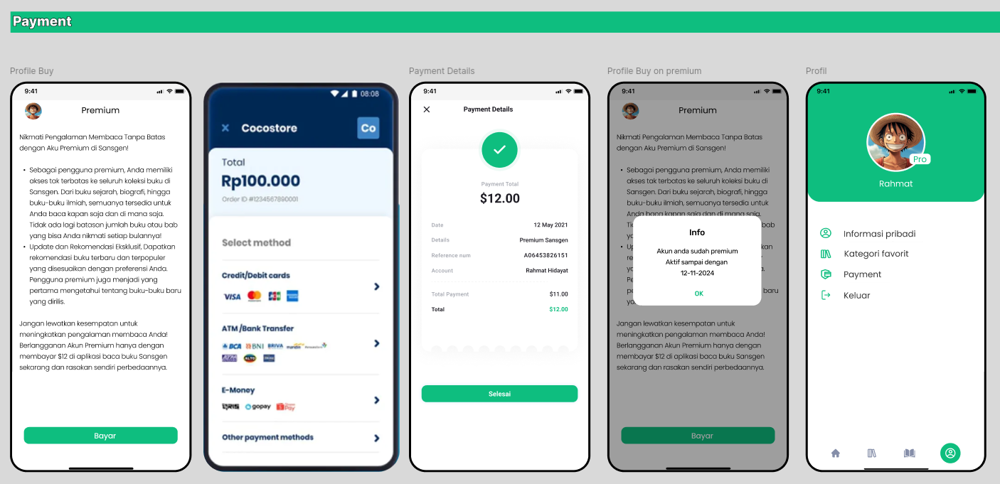
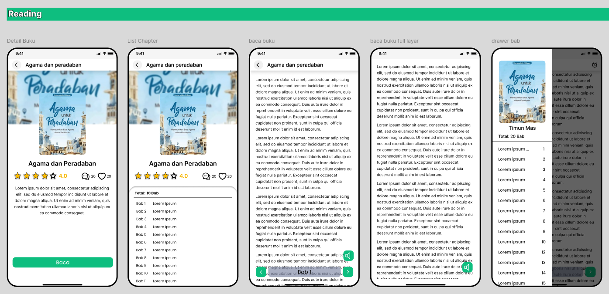

# Sansgen - Aplikasi Baca Buku

**Sansgen** adalah aplikasi baca buku yang menawarkan pengalaman membaca yang menyenangkan. Aplikasi ini dibangun menggunakan **Flutter** dengan state management **GetX** untuk mengelola state aplikasi. Backend aplikasi ini menggunakan **Laravel** yang berfungsi untuk mengelola data pengguna dan transaksi.

## Fitur Utama
- **Antarmuka Pengguna (UI)** yang modern dan responsif.
- **GetX State Management** untuk pengelolaan status aplikasi yang efisien.
- **Laravel Backend** untuk mengelola autentikasi pengguna, data buku, dan transaksi.
- Fitur utama meliputi **Pembayaran**, **Profil Pengguna**, **Kategori Buku**, dan **Audio** untuk pengalaman membaca yang lebih interaktif.

## UI Screenshots
Berikut adalah beberapa tampilan UI aplikasi **Sansgen** yang ada pada folder `assets/docs`:

### 1. Halaman Autentikasi


### 2. Halaman Awal


### 3. Halaman Utama


### 4. Halaman Kategori Buku


### 5. Halaman Rekomendasi Buku


### 6. Halaman Profil Pengguna


### 7. Halaman Pembayaran


### 8. Halaman Pencarian Buku


### 9. Halaman Membaca Buku


### 10. Halaman Audio


## Teknologi yang Digunakan
- **Flutter** untuk pengembangan aplikasi mobile.
- **GetX** untuk state management.
- **Laravel** untuk backend dan manajemen admin.
- **MySQL** untuk database.

## Instalasi

### Prasyarat:
- Pastikan Anda memiliki **Flutter** dan **Dart SDK** terinstal di sistem Anda.
- **Composer** dan **Laravel** untuk backend.

### Langkah-langkah untuk instalasi:
1. Clone repositori ini:
   ```bash
   git clone https://github.com/username/repo-sansgen.git
